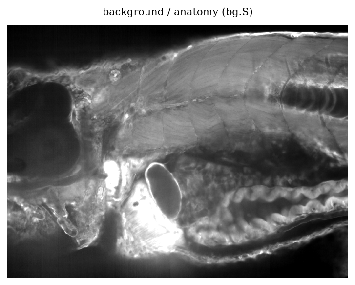
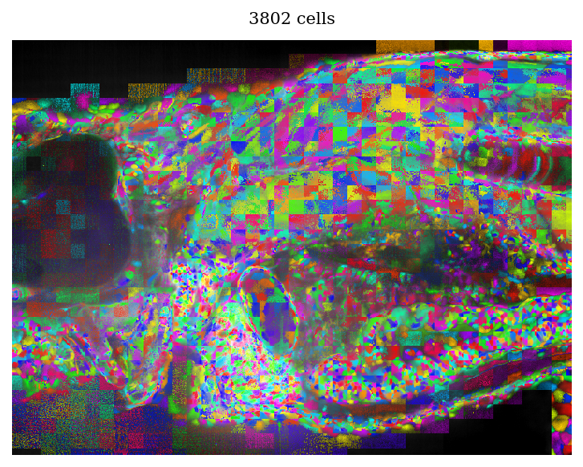
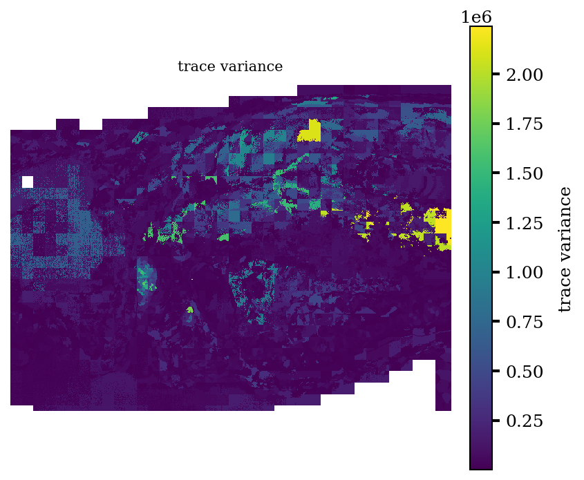
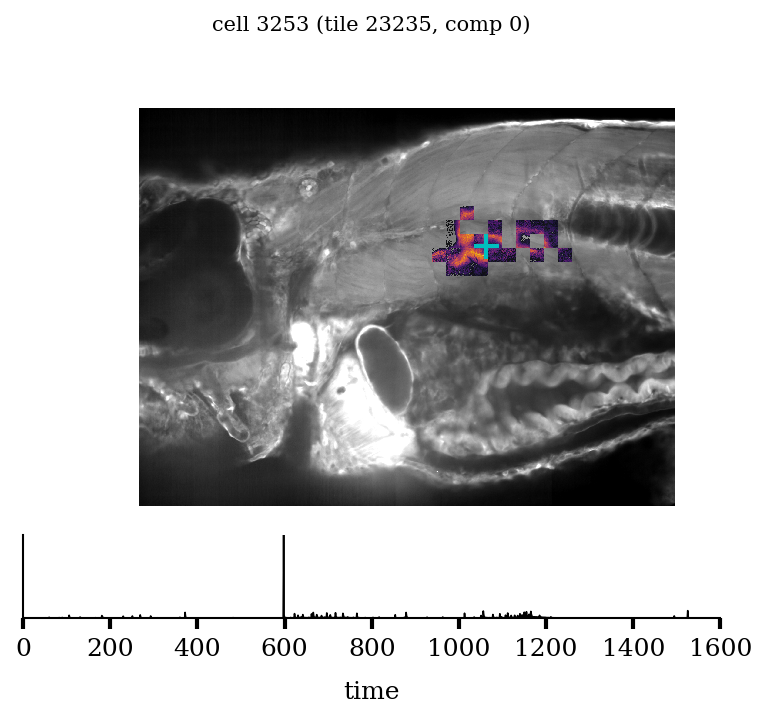
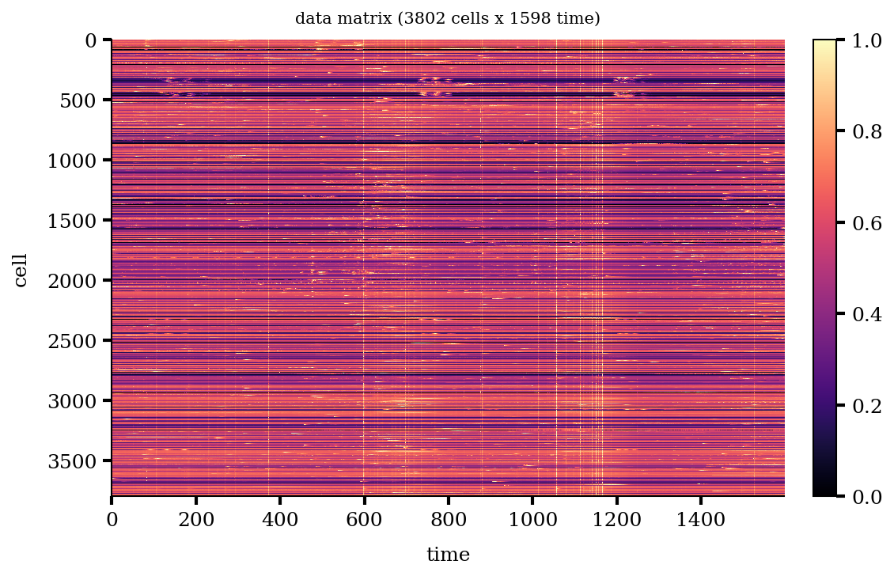
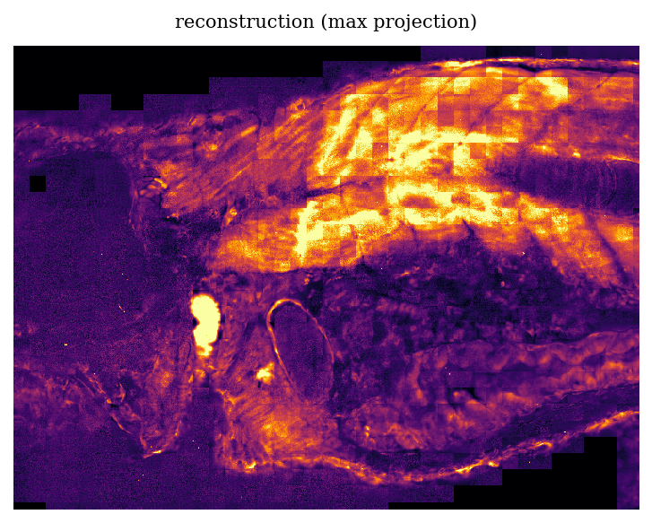

# holytrees

**Pure-Python inspection of Tim Holy's tiled-NMF pipeline output** — no Julia required.

Ran the tiled-NMF pipeline on some calcium-imaging data and got a `run_<id>.jld2`?
`holytrees` reads it directly (`h5py` + `numpy` + `matplotlib`) and gives you a clean
object model so you can:

- pull out **cells** (spatial footprint + temporal trace),
- build the cells × time **data matrix**,
- **reconstruct** the recording spatially (one vectorized scatter, never a giant cube),
- and **visualize** cells (random color with alpha ∝ spatial weight; or paint cells by any
  scalar, e.g. trace variance).

Works for both 2D and 3D (volumetric) runs.

## Install

```bash
# into your conda/venv environment
pip install -e .          # from a clone of this repo
# or, for development (tests + linting):
pip install -e ".[dev]"
```

Requires Python ≥ 3.10, `numpy`, `h5py`, `matplotlib`.

## Quickstart

```python
import holytrees as ht

run = ht.load(".../run_20260614_182728.jld2")   # a file, or a run_<id>/ directory
run.ntiles, run.ncells, run.ntimes               # cheap summary
run.bg.S                                          # (Y, X[, Z]) anatomy / background

cells  = run.cells          # list[Cell], canonical ordering
traces = run.traces         # (ncells, ntimes) float32 data matrix; row k <-> cells[k]

c = run.cells[0]
c.S, c.T, c.box, c.tileid, c.comp, c.centroid     # footprint, trace, location, metadata
c.centroid_global                                 # mapped back to the original recording

# spatial reconstruction (vectorized; no per-pixel Python loops, overlaps handled)
frame = run.reconstruct_frame(t=0)                # (Y, X[, Z]) at one time
proj  = run.reconstruct_maxproj()                 # amplitude-weighted projection

# scatter any per-cell quantity into space
vol  = run.fill(traces[:, 0], weighted=True, reduce="add")   # (Y, X[, Z])
vols = run.fill(feature_matrix, weighted=True)               # (nfeatures, ncells) -> stack

# visualization (each returns (fig, ax), accepts ax=/save=)
run.show_cells(colorby="random")                  # cell map, alpha ∝ weight
run.project(lambda c: c.T.var(), label="variance")# paint cells by a scalar
run.show_cell(k=0)                                # one cell over the anatomy + its trace
run.raster()                                      # the data matrix as an image
```

## Expected output

A handful of figures produced by [`demo.py`](demo.py) (run on a whole-brain zebrafish run):

| | |
|---|---|
| **Anatomy / background** (`bg.S`) | **Cells located** (random hue, alpha ∝ weight) |
|  |  |
| **Per-cell trace variance**, painted | **A single cell** + its trace |
|  |  |
| **Data matrix** (cells × time) | **Spatial reconstruction** (max projection) |
|  |  |

## Coordinate conventions

These are the only things that bite, so they are stated once and used everywhere:

- **Axis order** is `(Y, X[, Z])` for every spatial array (Julia's logical order; the reader
  reverses h5py's column-major axes for you).
- A `Box` stores **1-based inclusive** intervals exactly as Julia does; `box.slices` gives the
  **0-based half-open** numpy slices. That conversion is confined to `Box`.
- `run.cells[k]` and `run.traces[k]` are always **aligned** (one canonical ordering).
- Footprints, `bg.S`, `dev`, and reconstructions live in the **cropped analysis-window** frame.
  Use `cell.centroid_global` / `cell.box_global` (with `run.origin`) to map back to the original
  recording.

## How it reads the file

A `.jld2` file is just HDF5. `holytrees` decodes the Julia structs directly (object references,
`BitVector`s, `Box` intervals, strings, dicts), reverses array axes to `(Y, X[, Z])`, copies
everything into numpy, and **closes the file** — so a `Run` is picklable and holds no open
handles. The internal `tree` (BoxTree spatial index) is skipped; only what you need is decoded.

## License

MIT — see [LICENSE](LICENSE).
